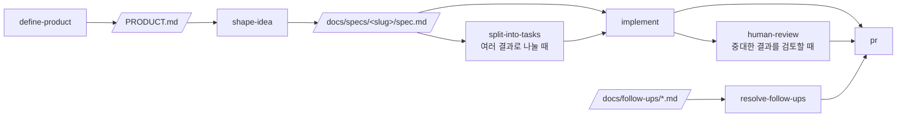

# 논문탐색기

> 검색어 대신 지금 하려는 일을 적으면, arXiv에서 관련 논문을 골라 근거와 함께 한국어 카드로 남깁니다.

논문을 찾는 일과 그중 내 일에 쓸모 있는 것을 골라내는 일은 다릅니다. 키워드를 바꿔가며 목록을 훑고, 초록을 AI에 붙여넣어 요약을 받고, 쓸 만한 것만 따로 만든 문서에 옮겨 적는 과정에서 시간은 대부분 뒤쪽에 들어갑니다. 그런데 AI 채팅은 대화가 끝나면 사라지고, 값어치가 쌓이는 곳은 손으로 옮겨 적은 그 문서입니다.

논문탐색기는 이 순서를 바꿉니다.

- **키워드를 고르지 않습니다.** "DLLM을 동형암호로 구현하려는데, diffusion 구조에 동형암호를 적용한 논문이 있어?"처럼 상황을 그대로 적으면 검색 질의는 알아서 만들어집니다.
- **근거 없는 추천을 하지 않습니다.** 왜 이 논문이 지금 상황과 관련 있는지 밝히지 못하는 논문은 카드로 만들지 않습니다. 쓸 만한 것이 없으면 개수를 채우지 않고 없다고 말합니다.
- **판단이 사라지지 않습니다.** 카드는 노트에 쌓여 related work를 쓸 때나 구현 중 막혔을 때 다시 열립니다. 같은 논문이 다른 질문에서 또 나오면 카드는 하나로 유지되고, 그 질문에 적용할 수 있는 부분만 덧붙습니다.

동형암호 연구를 염두에 두고 만들었지만 검색 범위는 arXiv 전체입니다. 질문이 동형암호와 닿지 않으면 억지로 그 항을 끼워넣지 않고 질문 그대로의 주제로 질의를 만듭니다.

## 어떻게 동작하나

1. **상황을 적습니다.** 찾기 화면(`/`)의 "지금 하려는 일" 칸에 문장으로 씁니다.
2. **검색 질의를 1～3개 만들어 arXiv를 훑습니다.** 질의마다 최신 제출순으로 12건까지 받아 중복을 걸러냅니다. 어떤 질의로 찾았는지는 결과에 그대로 드러나므로, 검색 범위가 좁았는지 직접 판단할 수 있습니다.
3. **초록을 읽고 최대 5건을 고릅니다.** 판단 근거는 초록이고 전문은 읽지 않습니다. 선별과 카드 작성은 Claude Haiku 4.5가 맡습니다.
4. **카드를 만듭니다.** 제목, 저자, 발표일, 출처, 핵심 기여, 장단점, **이 질문에 적용할 수 있는 부분**, 원문 링크, 선정 근거가 한국어로 들어갑니다. 기술 용어는 원문 표기를 유지해 원 논문을 찾아갈 수 있게 합니다.
5. **카드가 노트에 쌓입니다.** 노트 화면(`/note`)에서는 접힌 목록으로 훑고 제목을 눌러 펼쳐 읽습니다. 검색어와 질문으로 걸러낼 수 있습니다.
6. **더 볼 일 없는 카드는 지웁니다.** 되돌릴 수 없어 확인을 한 번 받습니다. 지우기는 카드 단위라 그 카드에 쌓인 질문이 함께 빠지고, 어떤 질문의 카드가 모두 빠지면 필터 목록에서 그 질문도 사라집니다.

학회·저널 정보는 arXiv 메타데이터에 있을 때만 표시하고, 없으면 preprint로 둡니다. 등급을 추측하지 않습니다.

## 지금 되는 것과 아직 아닌 것

되는 것은 상황 질문에서 카드가 노트에 쌓이고 다시 정리되기까지 한 줄기입니다. 아래는 의도적으로 미뤄둔 것입니다.

- 주 1회 자동 수집 — 노트에 쌓인 것이 있어야 자동 수집의 값어치를 확인할 수 있습니다.
- 검색 증강(RAG)과 임베딩 검색 — 검색 대상이 될 코퍼스가 먼저 쌓여야 합니다.
- arXiv 밖의 소스(IACR ePrint, 기업 연구 블로그)
- 논문 전문 요약
- 카드에 쌓인 질문 하나만 빼기 — 지우기는 카드 단위입니다.
- 로그인과 사용자별 노트 — 지금은 주소를 아는 사람이 모두 같은 노트를 보고, 쓰고, 지웁니다. [`docs/follow-ups/note-login-and-per-user.md`](docs/follow-ups/note-login-and-per-user.md)에 남겨두었습니다.

## 기술 스택

Next.js 16 (App Router) · React 19 · Tailwind CSS 4 · shadcn/ui · Supabase · Vercel AI SDK (Anthropic) · Bun · Vitest · Playwright

## 시작하기

```bash
bun install
bun dev
```

[http://localhost:3000](http://localhost:3000)에서 결과를 확인할 수 있습니다.

## 환경 변수

`.env.local`에 아래 값을 넣습니다. 배포할 때는 Vercel 프로젝트 설정의 Environment Variables에도 같은 값을 넣어야 합니다.

| 이름 | 용도 |
|---|---|
| `ANTHROPIC_API_KEY` | 검색어 계획과 초록 선별에 쓰는 Claude 모델 호출 |
| `SUPABASE_URL` | 노트를 저장할 Supabase 프로젝트 주소 |
| `SUPABASE_PUBLISHABLE_KEY` | Supabase publishable key. 서버에서만 읽으므로 브라우저로 나가지 않습니다 |

`service_role` 키나 secret key는 쓰지 않습니다.

## 노트 저장소

노트는 Supabase의 `note_cards` 테이블에 쌓입니다. Supabase 프로젝트를 만든 뒤 대시보드 SQL Editor에서 `supabase/migrations/`의 SQL을 파일 이름 순서대로 실행하면 테이블과 권한, 정책이 함께 만들어집니다.

같은 논문이 다른 질문에서 다시 나오면 카드는 하나로 두고 적용할 수 있는 부분만 이어 붙입니다. 이 병합은 `append_note_cards` 함수가 한 문장으로 처리하므로, 두 사람이 동시에 저장해도 카드가 유실되지 않습니다. 삭제는 `paper_id` 하나만 서버로 보내고 나머지는 서버에서 처리하므로, 화면이 들고 있던 값 때문에 지울 대상이 바뀌지 않습니다.

아직 로그인이 없어서 읽기·쓰기·삭제 정책이 모두 `anon`에게 열려 있습니다. 주소를 아는 사람은 누구나 같은 노트를 보고 씁니다. 사용자별로 나누는 일은 `docs/follow-ups/`에 남겨두었습니다.

## 스크립트

| 명령어 | 설명 |
|---|---|
| `bun dev` | 개발 서버 실행 |
| `bun run build` | 프로덕션 빌드 |
| `bun start` | 프로덕션 서버 실행 |
| `bun run lint` | ESLint 실행 |
| `bun run typecheck` | `tsc --noEmit` 타입 검사 |
| `bun run test` | Vitest 단위/컴포넌트 테스트 1회 실행 |
| `bun run test:watch` | Vitest watch 모드 |
| `bun run test:e2e` | Playwright E2E 테스트 실행 |

## 테스트

- **단위·컴포넌트**: Vitest + Testing Library. 설정은 `vitest.config.mts`, 매처와 cleanup은 `vitest.setup.ts`에 있습니다. 테스트 파일은 소스 옆에 `*.test.ts(x)`로 둡니다(`app/page.test.tsx`, `lib/utils.test.ts` 참고). `globals`를 켜지 않았으므로 `describe`/`it`/`expect`는 `vitest`에서 import 합니다.
- **E2E**: Playwright. 설정은 `playwright.config.ts`, 테스트는 `e2e/*.spec.ts`에 둡니다. `webServer`가 `bun run dev`를 자동으로 띄우므로 별도 서버 실행이 필요 없습니다.

E2E를 처음 실행하기 전에 브라우저를 한 번 내려받아야 합니다.

```bash
bunx playwright install chromium
```

브라우저가 이미 설치된 환경(예: Claude Code 원격 세션)에서는 내려받는 대신 실행 파일 경로를 지정할 수 있습니다.

```bash
PLAYWRIGHT_CHROMIUM_PATH=/opt/pw-browsers/chromium bun run test:e2e
```

`async` Server Component는 Vitest가 아직 지원하지 않으므로 E2E로 검증합니다.

## 프로젝트 문서

| 문서 | 내용 |
|---|---|
| [`PRODUCT.md`](PRODUCT.md) | 누가 어떤 상황에서 쓰는지, 무엇을 약속하고 무엇을 범위 밖에 두는지 |
| [`GLOSSARY.md`](GLOSSARY.md) | 상황 질문, 카드, 노트처럼 이 제품에서 뜻을 고정한 말 |
| [`docs/specs/`](docs/specs/) | 구현에 들어간 작업 단위의 수용 기준과 확정된 제약 |
| [`docs/decisions/`](docs/decisions/) | 다음 작업도 구속하는 결정과 그 근거 |
| [`docs/follow-ups/`](docs/follow-ups/) | 이번 범위에서 의도적으로 미뤄둔 항목 |
| [`AGENTS.md`](AGENTS.md) | 에이전트가 이 저장소에서 따라야 할 규칙 |

## Claude Code 워크플로우



파이프라인 밖에서는 `project-knowledge`, `maintain-project-context`, `add-stack-context`, `build-prototype`, `explain-visually`, `tdd`가 각자의 조건에 따라 켜집니다. `project-knowledge`는 `GLOSSARY.md`, `docs/decisions/`, `docs/follow-ups/`에 다음 작업에서도 재사용할 지식과 후속 항목을 남깁니다. Git 작업은 `commit`, `pull`, `push`, `pr`, `merge`가 해당 요청에 맞춰 처리합니다.

---

이 저장소는 [Claude Hunt](https://www.claude-hunt.com) 강의용 Next.js 템플릿에서 시작했습니다. 템플릿 사용법과 워크플로우 문서는 [docs.claude-hunt.com](https://docs.claude-hunt.com)에 있습니다.
