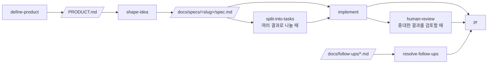

# Claude Code Playbook Template

[](https://www.claude-hunt.com)
[](https://docs.claude-hunt.com)

> [Claude Hunt](https://www.claude-hunt.com) 강의용 Next.js 16 + React 19 템플릿.
> 사용법과 워크플로우 문서는 [docs.claude-hunt.com](https://docs.claude-hunt.com)에서 확인하세요.

## 기술 스택

Next.js 16 (App Router) · React 19 · Tailwind CSS 4 · shadcn/ui · Bun · Vitest · Playwright

## 시작하기

```bash
bun install
bun dev
```

[http://localhost:3000](http://localhost:3000)에서 결과를 확인할 수 있습니다.

## 환경 변수

`.env.local`에 아래 값을 넣습니다. 배포할 때는 Vercel 프로젝트 설정의 Environment Variables에도 같은 값을 넣어야 합니다.

| 이름 | 용도 |
|---|---|
| `ANTHROPIC_API_KEY` | 검색어 계획과 초록 선별에 쓰는 Claude 모델 호출 |
| `SUPABASE_URL` | 노트를 저장할 Supabase 프로젝트 주소 |
| `SUPABASE_PUBLISHABLE_KEY` | Supabase publishable key. 서버에서만 읽으므로 브라우저로 나가지 않습니다 |

`service_role` 키나 secret key는 쓰지 않습니다.

## 노트 저장소

노트는 Supabase의 `note_cards` 테이블에 쌓입니다. Supabase 프로젝트를 만든 뒤 대시보드 SQL Editor에서 `supabase/migrations/`의 SQL을 한 번 실행하면 테이블과 권한, 정책이 함께 만들어집니다.

같은 논문이 다른 질문에서 다시 나오면 카드는 하나로 두고 적용할 수 있는 부분만 이어 붙입니다. 이 병합은 `append_note_cards` 함수가 한 문장으로 처리하므로, 두 사람이 동시에 저장해도 카드가 유실되지 않습니다.

아직 로그인이 없어서 주소를 아는 사람은 누구나 같은 노트를 보고 씁니다. 사용자별로 나누는 일은 `docs/follow-ups/`에 남겨두었습니다.

## 스크립트

| 명령어 | 설명 |
|---|---|
| `bun dev` | 개발 서버 실행 |
| `bun run build` | 프로덕션 빌드 |
| `bun start` | 프로덕션 서버 실행 |
| `bun run lint` | ESLint 실행 |
| `bun run typecheck` | `tsc --noEmit` 타입 검사 |
| `bun run test` | Vitest 단위/컴포넌트 테스트 1회 실행 |
| `bun run test:watch` | Vitest watch 모드 |
| `bun run test:e2e` | Playwright E2E 테스트 실행 |

## 테스트

- **단위·컴포넌트**: Vitest + Testing Library. 설정은 `vitest.config.mts`, 매처와 cleanup은 `vitest.setup.ts`에 있습니다. 테스트 파일은 소스 옆에 `*.test.ts(x)`로 둡니다(`app/page.test.tsx`, `lib/utils.test.ts` 참고). `globals`를 켜지 않았으므로 `describe`/`it`/`expect`는 `vitest`에서 import 합니다.
- **E2E**: Playwright. 설정은 `playwright.config.ts`, 테스트는 `e2e/*.spec.ts`에 둡니다. `webServer`가 `bun run dev`를 자동으로 띄우므로 별도 서버 실행이 필요 없습니다.

E2E를 처음 실행하기 전에 브라우저를 한 번 내려받아야 합니다.

```bash
bunx playwright install chromium
```

브라우저가 이미 설치된 환경(예: Claude Code 원격 세션)에서는 내려받는 대신 실행 파일 경로를 지정할 수 있습니다.

```bash
PLAYWRIGHT_CHROMIUM_PATH=/opt/pw-browsers/chromium bun run test:e2e
```

`async` Server Component는 Vitest가 아직 지원하지 않으므로 E2E로 검증합니다.

## Claude Code 워크플로우



파이프라인 밖에서는 `project-knowledge`, `maintain-project-context`, `add-stack-context`, `build-prototype`, `explain-visually`, `tdd`가 각자의 조건에 따라 켜집니다. `project-knowledge`는 `GLOSSARY.md`, `docs/decisions/`, `docs/follow-ups/`에 다음 작업에서도 재사용할 지식과 후속 항목을 남깁니다. Git 작업은 `commit`, `pull`, `push`, `pr`, `merge`가 해당 요청에 맞춰 처리합니다.
